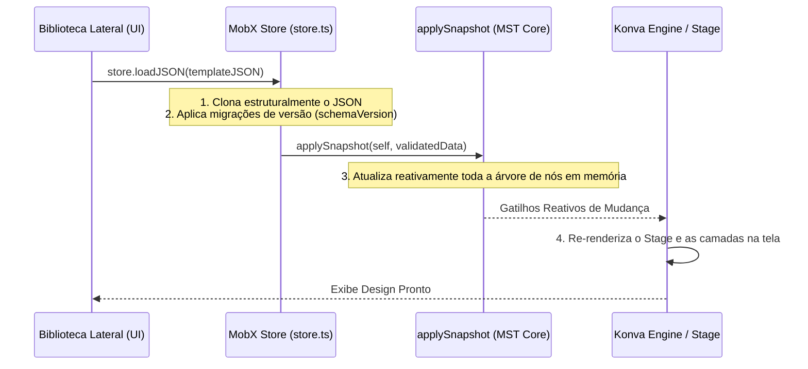

# Auditoria de Templates e Compatibilidade com o Carrossel Studio

Este relatório apresenta uma análise técnica aprofundada do sistema de templates do **OpenPolotno**, avaliando sua estrutura de dados (JSON), fluxos de serialização e desserialização, portabilidade de recursos estáticos e a viabilidade de integração direta com a arquitetura e o banco de dados Supabase do **Carrossel Studio**.

---

## 📂 Parte 1 — Localização do Sistema de Templates

O sistema de templates do OpenPolotno opera de forma totalmente descentralizada no frontend do cliente, sendo estruturado sob a reatividade do **MobX State Tree (MST)**.

### 📋 Mapeamento de Arquivos e Responsabilidades

1. **[store.ts](file:///C:/Users/Gustavo/apps/Carrossel%20Studio/docs/Estudo_OpenPolotno_Repo/src/model/store.ts):**
   * *Responsabilidade:* Centraliza os métodos globais `toJSON()` e `loadJSON(json)`.
   * *Ação:* `toJSON()` gera o snapshot imutável de todo o estado do canvas. `loadJSON()` analisa a versão do esquema (`schemaVersion`), aplica migrações de dados legados, define a página ativa e injeta o snapshot de forma reativa na store global usando a chamada nativa `applySnapshot()`.
2. **[page-model.ts](file:///C:/Users/Gustavo/apps/Carrossel%20Studio/docs/Estudo_OpenPolotno_Repo/src/model/page-model.ts):**
   * *Responsabilidade:* Define as propriedades estruturais de cada página (`Page`), incluindo dimensões, tempo de exibição, sangria (`bleed`), cor de fundo (`background`) e o array de elementos filhos (`children`).
3. **[node-model.ts](file:///C:/Users/Gustavo/apps/Carrossel%20Studio/docs/Estudo_OpenPolotno_Repo/src/model/node-model.ts) & [shape-model.ts](file:///C:/Users/Gustavo/apps/Carrossel%20Studio/docs/Estudo_OpenPolotno_Repo/src/model/shape-model.ts):**
   * *Responsabilidade:* Modelam os nós de elementos visuais genéricos (`id`, `type`, `x`, `y`, `width`, `height`, `rotation`, `opacity`, `visible`, `locked`).
4. **Modelos Específicos por Tipo (`text-model.ts`, `image-model.ts`, etc.):**
   * *Responsabilidade:* Declaram propriedades adicionais exclusivas (ex: `text`, `fontSize` e `fontFamily` para textos; `src` e `crop` para fotos; `file` para caminhos de vetores SVG).
5. **[templates-panel.tsx](file:///C:/Users/Gustavo/apps/Carrossel%20Studio/docs/Estudo_OpenPolotno_Repo/src/side-panel/templates-panel.tsx):**
   * *Responsabilidade:* Componente visual que exibe a galeria lateral de designs e dispara o carregamento do JSON na store ao clique do usuário.

---

## 📊 Parte 2 — Estrutura Completa do JSON

Extraímos a anatomia estrutural de dados real utilizada pelo OpenPolotno com base nos esquemas do MobX State Tree. Veja a representação JSON real de um design:

```json
{
  "width": 1080,
  "height": 1350,
  "unit": "px",
  "dpi": 72,
  "schemaVersion": 2,
  "fonts": [
    {
      "fontFamily": "Outfit",
      "url": "https://fonts.gstatic.com/s/outfit/v11/q35yFyF3HgHNrR41Raxx.ttf",
      "styles": ["regular", "500", "700"]
    }
  ],
  "pages": [
    {
      "id": "page-98af-4b21",
      "background": "#121214",
      "duration": 5000,
      "bleed": 0,
      "children": [
        {
          "id": "shape-1b2c",
          "type": "figure",
          "x": 0,
          "y": 0,
          "width": 1080,
          "height": 200,
          "rotation": 0,
          "opacity": 0.15,
          "visible": true,
          "locked": false,
          "fill": "linear-gradient(90deg, #aa3bff 0%, #00a1ff 100%)",
          "name": "rectangle"
        },
        {
          "id": "text-77ad",
          "type": "text",
          "x": 100,
          "y": 400,
          "width": 880,
          "height": 180,
          "rotation": 0,
          "opacity": 1,
          "visible": true,
          "locked": false,
          "text": "<p><strong>Revolucione</strong> seus carrosséis</p>",
          "fontSize": 56,
          "fontFamily": "Outfit",
          "fill": "#FFFFFF",
          "align": "left",
          "lineHeight": 1.25,
          "letterSpacing": -1.2
        },
        {
          "id": "image-cd3a",
          "type": "image",
          "x": 200,
          "y": 650,
          "width": 680,
          "height": 500,
          "rotation": -3,
          "opacity": 1,
          "visible": true,
          "locked": false,
          "src": "https://images.unsplash.com/photo-1618005182384-a83a8bd57fbe?w=800",
          "crop": {
            "x": 0,
            "y": 0.1,
            "width": 1,
            "height": 0.8
          },
          "cornerRadius": 16,
          "shadow": {
            "blur": 25,
            "color": "rgba(0,0,0,0.3)",
            "offsetX": 0,
            "offsetY": 15
          }
        }
      ]
    }
  ],
  "audios": []
}
```

---

## 📐 Parte 3 — Anatomia de um Template

A modelagem de dados do OpenPolotno é altamente compacta e organizada hierarquicamente.

### 🔑 Propriedades Estruturais Principais:
* **`width` / `height` (Obrigatórios):** Dimensões físicas do palco de pintura do canvas.
* **`fonts` (Recomendado):** Um array contendo as famílias de fontes tipográficas externas que devem ser injetadas de forma dinâmica no cabeçalho do documento para renderização perfeita de textos.
* **`pages` (Obrigatório):** Array contendo os snapshots de cada página do design.
  * **`children` (Obrigatório):** Array contendo todos os elementos visuais (nós) de desenho pertencentes àquela página específica.
* **`custom` (Opcional):** Um objeto livre e genérico para os desenvolvedores embutirem metadados personalizados do SaaS (ex: autor, categoria, se é premium/grátis, tags de pesquisa).

---

## 🔄 Parte 4 — Processo de Carregamento (Deserialização)

O fluxo de carregamento de um template na tela ocorre inteiramente em memória no lado do cliente:



1. **Gatilho de Entrada:** O JSON do design (seja vindo de uma API, arquivo local ou Supabase) é injetado via `store.loadJSON()`.
2. **Normalização:** A store normaliza o JSON e aplica migrações automáticas de esquemas anteriores (como normalizar letter-spacing de textos HTML ou filtros de imagens).
3. **Aplicação do Estado:** O MST executa o `applySnapshot(self, data)`, substituindo toda a árvore de dados ativa em milissegundos.
4. **Renderização Visual:** O React-Konva detecta as alterações reativas de atributos de coordenadas, rotações e cores na store e atualiza as coordenadas de desenho do canvas HTML5 instantaneamente.

---

## 💾 Parte 5 — Processo de Salvamento (Serialização)

Toda interação do usuário no Canvas (mover, mudar cor, digitar) altera as propriedades da Store de forma síncrona e em tempo real. O salvamento consiste apenas em extrair essa árvore reativa de volta para texto:

1. **Gatilho de Saída:** O editor chama a função `store.toJSON()`.
2. **Extração de Instantâneo:** O MobX State Tree executa o método nativo de serialização rápida `getSnapshot(store)`.
3. **Retorno do JSON:** O retorno é um objeto JavaScript limpo contendo as propriedades estritas do canvas e elementos (`width`, `height`, `fonts`, `pages`, `audios`), ignorando estados temporários de interface (ex: zoom do usuário, caixas de seleção ativas, guias de snapping).
4. **Gravação:** Esse objeto é serializado em string (`JSON.stringify()`) e enviado ao backend.

---

## ⚖️ Parte 6 — Compatibilidade com Carrossel Studio

Se o **Carrossel Studio** já possui uma biblioteca com mais de 300 templates, qual é a melhor estratégia técnica para portabilidade?

### 🏆 Veredito: **(A) Converter templates atuais para JSON do OpenPolotno**

#### Justificativa Técnica:
Escrever um **script conversor (parser) simples em JavaScript** no frontend ou backend é infinitamente mais produtivo e seguro do que recriar 300 designs manualmente na tela.
Como elementos de canvas tradicionais compartilham de propriedades geométricas universais idênticas (caixas de texto têm `fontSize`, `fontFamily`, `x`, `y`, `fill`; imagens têm `src`, `width`, `height`, `rotation`), é possível varrer os objetos JSON antigos e traduzir suas chaves em 1-para-1 para o padrão OpenPolotno. 

O script rodará em fração de segundos, garantindo a migração instantânea de toda a base de designs.

---

## 🗃️ Parte 7 — Criação de Biblioteca Própria (Supabase)

> [!TIP]
> **Autonomia Total:**
> **SIM**, é 100% possível criar uma aba de templates própria, categorias, busca, favoritos e controle de premium/free sem depender de nenhuma chamada ou infraestrutura da Polotno.

Para fazer isso, nós simplesmente substituímos o componente de visualização de templates original por um componente customizado do Carrossel Studio:

### 🧩 Componentes Afetados e Plano de Adaptação:
* **[templates-panel.tsx](file:///C:/Users/Gustavo/apps/Carrossel%20Studio/docs/Estudo_OpenPolotno_Repo/src/side-panel/templates-panel.tsx):** Este arquivo faz chamadas HTTP para `api.polotno.com/api/get-templates`. 
* **Ajuste:** Substituir a busca interna por uma consulta direta à nossa tabela do **Supabase** (ex: `supabase.from('templates').select('*')`).
* **Estrutura no Banco (PostgreSQL/Supabase):**
  * Tabela `templates`: `id`, `name`, `thumbnail_url` (URL da foto do design salva no bucket storage), `json_data` (coluna do tipo `jsonb` guardando o retorno de `store.toJSON()`), `category` (texto), `is_premium` (booleano), `created_at`.
* **Geração de Miniaturas:** Para salvar o template, nós geramos a miniatura do design localmente via `store.toDataURL({ pixelRatio: 0.5 })` e fazemos o upload do PNG gerado para um bucket público do Supabase Storage. Esse link vira a `thumbnail_url` exibida na galeria.

---

## 📦 Parte 8 — Assets Embutidos e Portabilidade

* **Imagens:** Armazenadas no JSON apenas como URLs estáticas de rede (ex: `https://seu-bucket.supabase.co/...` ou `https://images.unsplash.com/...`).
* **Fontes:** Armazenadas como metadados contendo o nome da família e o link direto do arquivo `.ttf` ou `.woff2` para download.
* **SVGs:** Armazenam a URL de rede do arquivo vetorial.

> [!IMPORTANT]
> **Veredito sobre Portabilidade:**
> **Os templates são 100% portáveis.** Como o JSON armazena apenas metadados e ponteiros de endereços de mídias/fontes na internet, o arquivo final é extremamente leve (geralmente menor que 50KB). Você pode transferi-lo de banco de dados, compartilhá-lo ou baixá-lo livremente, desde que as URLs de imagens e fontes apontadas nos campos permaneçam acessíveis no ar.

---

## ⚡ Parte 9 — Importação em Massa (Supabase)

> [!IMPORTANT]
> **É possível criar esse fluxo sem alterações profundas?**
> **SIM.**

#### Justificativa:
O fluxo `Supabase DB → Consulta Cliente → store.loadJSON(dados)` é um recurso nativo do core do OpenPolotno. O método `loadJSON` está totalmente exportado para a API de consumo externo e consome qualquer objeto JSON estruturado de forma isolada, não requerendo nenhuma alteração de código ou refatoração profunda na lógica visual do Canvas.

---

## 🏁 Parte 10 — Avaliação Final

1. **O formato de template do OpenPolotno é bom?** **Excelente.** Baseado em snapshots puros de árvores de dados reativas, o que é de fácil depuração.
2. **É adequado para um SaaS?** **Excelente.** Extremamente leve, otimizando custos de tráfego de rede e latência de carregamento.
3. **Escala para centenas/milhares de templates?** **Excelente.** O PostgreSQL (Supabase) gerencia a busca rápida, indexação e paginação de colunas `jsonb` de forma impecável, comportando o crescimento de base sem engargalar.
4. **É adequado para o Carrossel Studio?** **Excelente.** Garante portabilidade de designs e compatibilidade de renderização nativa em tempo real.

### 🏆 Classificação de Arquitetura de Templates:
<br>
<div align="center">
  <h3><strong>Excelente</strong></h3>
</div>

---

## 🎯 Conclusão Obrigatória

Se o seu objetivo for transformar o OpenPolotno no Canvas Editor principal do Carrossel Studio, o sistema de templates é classificado como:

<br>
<div align="center">
  <h3><strong>"Requer pequenas adaptações"</strong></h3>
</div>

**Motivo:** Toda a infraestrutura interna de carregamento (`loadJSON`), salvamento (`toJSON`) e estrutura JSON está **100% pronta para produção comercial e robusta**. A única adaptação exigida é na camada visual do painel de seleção (`TemplatesPanel`), mudando as chamadas de busca HTTP de `api.polotno.com` para a API de listagem do seu banco de dados Supabase e hospedando suas próprias fontes e formas. É um ajuste estritamente de integração, sem necessidade de reescrever lógica interna do canvas.
