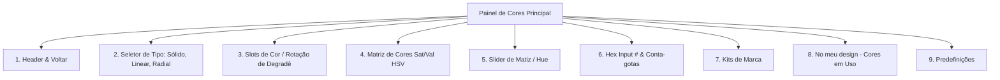

# 🎨 Base de Conhecimento - Canvas Editor

Esta documentação serve como guia técnico e conceitual sobre a estrutura do **Canvas Editor**. Ela foi desenhada para permitir que desenvolvedores e inteligências artificiais (IAs) localizem e modifiquem componentes, painéis e fluxos de dados de forma rápida e precisa.

---

## 🗺️ Mapa de Arquivos do Canvas Editor

A estrutura física do editor está localizada em `src/components/editor/` e é composta pelos seguintes arquivos:

| Nome do Arquivo | Tipo | Descrição |
| :--- | :--- | :--- |
| [`CanvasEditorPage.tsx`](file:///C:/Users/Gustavo/apps/Carrossel%20Studio/src/components/editor/CanvasEditorPage.tsx) | Componente Central | Gerencia o layout geral, a barra de ferramentas, a montagem do Canvas interativo (Konva) e a inicialização de estados principais. |
| [`DesignPropertiesPanel.tsx`](file:///C:/Users/Gustavo/apps/Carrossel%20Studio/src/components/editor/DesignPropertiesPanel.tsx) | Painel Principal | Contém as configurações gerais do design ativo (dimensões, dobras, grelha, transbordo e título do projeto). |
| [`ColorPickerPanel.tsx`](file:///C:/Users/Gustavo/apps/Carrossel%20Studio/src/components/editor/ColorPickerPanel.tsx) | Componente Isolado | **Painel de Cores Principal** que agrupa a seleção de tipos de fundo, slots de degradê, matriz HSV, entrada HEX, kits de marca, cores em uso e predefinições. |
| [`colorUtils.tsx`](file:///C:/Users/Gustavo/apps/Carrossel%20Studio/src/components/editor/colorUtils.tsx) | Módulo Utilitário | Centraliza algoritmos matemáticos de conversão de cores (`HEX <-> RGB <-> HSV`), parser de gradientes (`linear`/`radial`) e geradores de ícones SVG. |

---

## 🏗️ Estrutura e Itens do Painel de Cores Principal (`ColorPickerPanel.tsx`)

Quando você precisar solicitar alterações no **Painel de Cores Principal**, refira-se ao arquivo [`ColorPickerPanel.tsx`](file:///C:/Users/Gustavo/apps/Carrossel%20Studio/src/components/editor/ColorPickerPanel.tsx). A estrutura interna desse painel está mapeada conforme o diagrama abaixo:

### Detalhamento dos Elementos e seus Identificadores:

1. **Header do Painel (`ArrowLeft` + Título "Cor")**:
   - Botão para retornar ao painel principal (`onBack`).
   - Título centralizado com a tipografia padrão do Carrossel Studio.
2. **Tipo de Fundo (`dropdown` tipo `solid`, `linear` ou `radial`)**:
   - Menu dropdown acionado por um botão dinâmico contendo o ícone correspondente ao tipo de fundo ativo (Sólido, Linear ou Radial).
3. **Seleção de Slots de Cor (Sólido ou Degradê)**:
   - Se o tipo for `Sólido`: Mostra apenas um slot indicador com a cor ativa.
   - Se o tipo for `Linear` ou `Radial`: Exibe dois slots de clique (`Cor 1` e `Cor 2`) que controlam a parada ativa (`activeStopIndex`).
   - *Apenas para Linear*: Exibe também o controle de "Ângulo de rotação" com slider (`input type="range"` de `0°` a `360°`).
4. **Seletor Sat/Val (HSV)**:
   - Área interativa de `130px` de altura que permite selecionar saturação (eixo X) e valor/brilho (eixo Y) arrastando o cursor.
5. **Barra Deslizante de Hue**:
   - Barra horizontal com o gradiente arco-íris para alteração do matiz (Hue) de `0` a `360` graus.
6. **Hexadecimal Input & Conta-gotas**:
   - Input textual mono-espaçado para digitação direta da cor em HEX (com uppercase automático).
   - Botão Conta-gotas que ativa a API nativa do navegador (`EyeDropper`) para capturar cores fora da tela.
7. **Kits de Marca**:
   - Exibe a label `KITS DE MARCA` acompanhada do ícone 👑.
   - Contém o botão de atalho tracejado para fazer upload e adicionar novos kits de marca.
8. **No Meu Design (Cores em Uso)**:
   - Identificado pela label `NO MEU DESIGN`.
   - Lê dinamicamente as cores de fundo e elementos presentes em todos os slides da store e exibe até 10 botões de cores rápidas.
9. **Predefinição**:
   - Identificado pela label `PREDEFINIÇÃO`.
   - Grid compacto de 20 cores pré-configuradas e prontas para seleção imediata.

---

## 🛠️ Design Properties Panel (`DesignPropertiesPanel.tsx`)

Este é o painel de configuração global do design aberto, composto por:

- **Tamanho**: Seletor com tamanhos predefinidos (Instagram Portrait, Instagram Quadrado, Story/Reels, A4 Imprimir) ou "Customizado".
- **Imagem de Fundo**: Dropdown para chavear o tipo de renderização de fundo ou escolher uma cor/gradação abrindo o subpainel de cores.
- **Estilos**: Atalho para aplicar rapidamente uma paleta de estilos predefinida e botão para abrir a aba de backgrounds.
- **Título**: Input de texto síncrono para edição do nome do projeto.
- **Esquema (Grid)**: Interruptor liga/desliga para exibição de grelha de alinhamento com slider de controle do tamanho em pixels.
- **Dobras**: Seletor dinâmico para sobreposição de linhas guias de dobras (Dípticos, Trípticos e Quatro painéis verticais ou horizontais).
- **Transbordo (Bleed)**: Controle deslizante de transbordo de segurança (margem de corte do slide).

---

## 🚀 Guia de Referência Rápida para IA (Copiar & Colar)

> [!TIP]
> Use as frases abaixo para se referir de forma ultra-rápida aos elementos do Canvas Editor em suas instruções para a IA:

* *"IA, modifique o comportamento do dropdown de tipos no **Painel de Cores Principal** em [ColorPickerPanel.tsx](file:///C:/Users/Gustavo/apps/Carrossel%20Studio/src/components/editor/ColorPickerPanel.tsx)."*
* *"IA, altere as cores padrão presentes na seção de **Predefinições** do **Painel de Cores Principal** em [ColorPickerPanel.tsx](file:///C:/Users/Gustavo/apps/Carrossel%20Studio/src/components/editor/ColorPickerPanel.tsx)."*
* *"IA, mude o estilo do slider de ângulo no **Painel de Cores Principal** em [ColorPickerPanel.tsx](file:///C:/Users/Gustavo/apps/Carrossel%20Studio/src/components/editor/ColorPickerPanel.tsx)."*
* *"IA, adicione uma nova opção de tamanho de slide no **Painel de Design** em [DesignPropertiesPanel.tsx](file:///C:/Users/Gustavo/apps/Carrossel%20Studio/src/components/editor/DesignPropertiesPanel.tsx)."*
